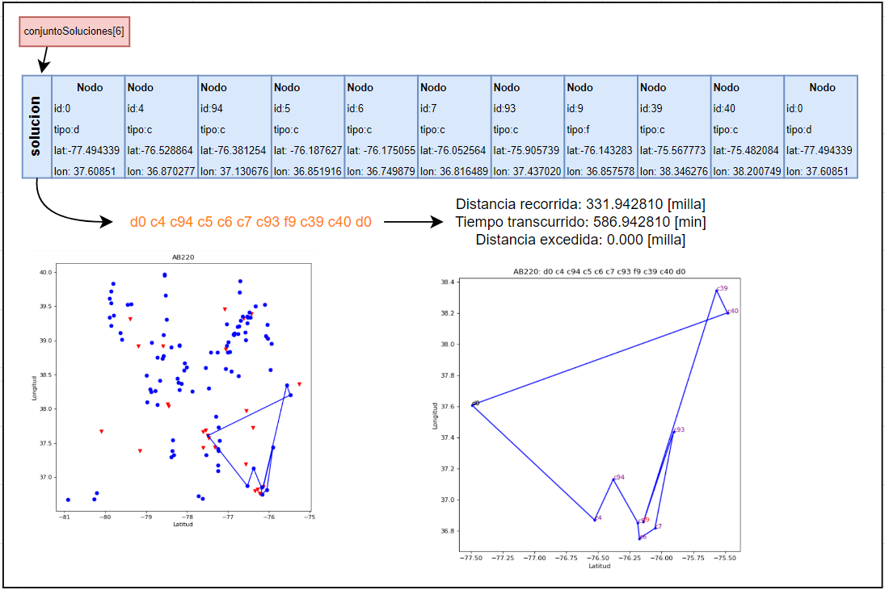

# Green Vehicle Routing Problem (G-VRP)

> Solución al problema de rutas óptimas para flotas de vehículos de combustible alternativo mediante metaheurísticas y búsqueda greedy.

---

## Descripción

El **Green Vehicle Routing Problem (G-VRP)** consiste en encontrar el conjunto de rutas óptimas para una flota de vehículos de combustible alternativo (AFV) que deben atender a un conjunto de clientes, minimizando la distancia total recorrida. Dado que estos vehículos poseen **autonomía limitada**, es necesario planificar paradas en estaciones de recarga de combustible alternativo (AFS) durante las rutas.

Este proyecto implementa y compara tres algoritmos de resolución sobre los datasets de referencia propuestos por Erdogan y Miller-Hooks (2012).

---

## Algoritmos Implementados

| Algoritmo | Descripción |
|-----------|-------------|
| **Greedy** | Búsqueda golosa que siempre agrega el nodo cliente más cercano al actual |
| **SA + Swap** | Simulated Annealing con movimiento swap (intercambio aleatorio de dos nodos) |
| **SA + 2-opt** | Simulated Annealing con movimiento 2-opt (inversión de segmento de ruta) |

El flujo general consiste en generar una solución inicial con Greedy y luego optimizarla iterativamente con Simulated Annealing.

---

## Estructura del Proyecto

```
gvrp/
├── src/
│   ├── main.cpp              # Punto de entrada
│   ├── greedy.cpp            # Algoritmo de búsqueda greedy
│   ├── simulatedAnnealing.cpp# Algoritmo SA (swap y 2-opt)
│   ├── utils.cpp             # Funciones auxiliares (distancia Haversine, etc.)
│   └── structs.h             # Definición de estructuras (nodo, dataSol, etc.)
├── data/
│   ├── AB1/                  # Instancias set AB1 (50–100 clientes, autonomía estándar)
│   └── AB2/                  # Instancias set AB2 (50–100 clientes, menor autonomía)
├── results/                  # Resultados de experimentos
└── README.md
```

---

## Compilación y Ejecución

### Requisitos

- Sistema operativo: Linux / WSL2
- Compilador: `g++` (Ubuntu 9.4.0 o superior)
- C++17 o superior

### Compilar

```bash
g++ -std=c++17 -O2 -o gvrp src/main.cpp src/greedy.cpp src/simulatedAnnealing.cpp src/utils.cpp
```

### Ejecutar

```bash
./gvrp <instancia> <algoritmo> [temperatura] [alfa]
```

**Parámetros:**
- `<instancia>`: ruta al archivo de instancia (ej. `data/AB1/AB110.txt`)
- `<algoritmo>`: `greedy`, `sa_swap`, o `sa_2opt`
- `[temperatura]`: temperatura inicial para SA (default: `665`)
- `[alfa]`: tasa de enfriamiento para SA (default: `0.8`)

**Ejemplo:**

```bash
./gvrp data/AB1/AB110.txt sa_swap 665 0.8
```

---

## Representación de la Solución

Las estructuras principales utilizadas son:

- **`nodo`**: Representa un cliente, estación de combustible o depósito. Contiene `id`, `tipo` y coordenadas `(latitud, longitud)`.
- **`dataSol`**: Almacena combustible remanente, distancia recorrida y tiempo usado de una ruta.
- **`solucion`**: Arreglo 1D de nodos representando la ruta de un vehículo.
- **`conjuntoSoluciones`**: Arreglo 2D con todas las rutas de la flota.
- **`conjuntoDataSoluciones`**: Arreglo 1D de `dataSol` asociado a cada ruta.


La figura presenta un ejemplo del uso de la representación en la solución final para la instancia AB220 usando el algoritmo SA con 2-opt


---

## Resultados Experimentales

Los experimentos se realizaron sobre los sets **AB1** y **AB2** (40 instancias, 50–100 clientes c/u).

### Experimento 1 & 2 — Comparación de algoritmos (α = 0.8, T = 665)

| Algoritmo | Calidad Solución | Clientes Atendidos | Vehículos | Tiempo Ejec. (s) |
|-----------|------------------|--------------------|-----------|------------------|
| Greedy (AB1) | 1683.78 | 71.10 | 7.6 | 0.00143 |
| SA + 2-opt (AB1) | 1525.57 | 73.25 | 6.2 | 0.01834 |
| **SA + Swap (AB1)** | **1510.17** | **73.25** | **6.2** | 0.01488 |

> **SA + Swap** obtiene la mejor calidad de solución en ambos sets.

### Experimento 3 — Impacto de la temperatura inicial (α = 0.8 fijo)

- La calidad de la solución se mantiene relativamente estable para distintos valores de T.
- Temperaturas más bajas reducen el tiempo de ejecución (~1 orden de magnitud).

### Experimento 4 — Impacto de la tasa de enfriamiento α (T = 100 fijo)

| α | SA + Swap Calidad | Tiempo (s) |
|---|-------------------|------------|
| 0.50 | 1529.21 | 0.00318 |
| 0.80 | 1522.13 | 0.00636 |
| **0.99** | **1470.32** | 0.10087 |

> **α cercano a 1** produce la mejor calidad al permitir mayor exploración, a costa de mayor tiempo de cómputo.

---

## Modelo Matemático

El problema se formula como un **MILP (Mixed Integer Linear Program)** según Erdogan y Miller-Hooks (2012):

**Función objetivo:**

$$\min \sum_{i,j \in V', i \neq j} d_{ij} x_{ij}$$

Sujeto a restricciones de:
- Visita única por cliente
- Conservación de flujo
- Límite de vehículos
- Autonomía de combustible
- Tiempo máximo de ruta

---

## Referencias

1. Erdogan, S. & Miller-Hooks, E. (2012). *A green vehicle routing problem*. Transportation Research Part E.
2. Andelmin, J. & Bartolini, E. (2017). *An exact algorithm for the green vehicle routing problem*. Transportation Science.
3. Bruglieri, M. et al. (2019). *A path-based solution approach for the green vehicle routing problem*. Computers & Operations Research.
4. Koc, C. & Karaoglan, I. (2016). *The green vehicle routing problem: A heuristic based exact solution approach*. Applied Soft Computing.
5. Montoya, A. et al. (2016). *A multi-space sampling heuristic for the green vehicle routing problem*. Transportation Research Part C.
6. Schneider, M. et al. (2014). *The electric vehicle-routing problem with time windows and recharging stations*. Transportation Science.

---

## Autor

**Víctor Antonio Martínez Campos**  
Curso: Inteligencia Artificial  
Fecha: Julio 2022


---

Ejecución:
    * Para facilitar la obtención de data sin tener que ir cambiado repetidamente el código
    agregué algunas facilidades:

    Ejemplo ejecución: make name=AB101 mode=G

        name: Nombre de la instancia a ejecutar
        mode:
            mode=G , 
                Se generan archivos de lectura .out en la carpeta outGreedy lo cuales contienen las soluciones
                al ejecutar solo búsqueda greedy sobre las instancias
            mode=SAS
                Se generan archivos de lectura .out en la carpeta outSAS lo cuales contienen las soluciones
                al ejecutar Simulated annealing + swap sobre las instancias
            mode=SAO
                Se generan archivos de lectura .out en la carpeta outSA3OPT lo cuales contienen las soluciones
                al ejecutar Simulated annealing + 2-OPT sobre las instancias

    * Para eliminar archivos *.o: make clean
    * Para eliminar archivos *.o y *.out de todas las carpetas: make cleanAll
    * Para eliminar archivos *.o y *.out de la carpeta outGreedy: make cleanG
    * Para eliminar archivos *.o y *.out de la carpeta outSAS: make cleanSAS
    * Para eliminar archivos *.o y *.out de la carpeta outSA2OPT: make cleanSAO

# Observaciones:
* Agregué unos script de bash que permiten generar todas soluciones para su posterior análisis:
    Ejecución: bash loopGvrp.sh
    Ejecución: bash firstLine.sh

* Las carpetas outGreedy, outSAOPT y outSAS deben estar presentes o el programa no guardará los archivos.
    